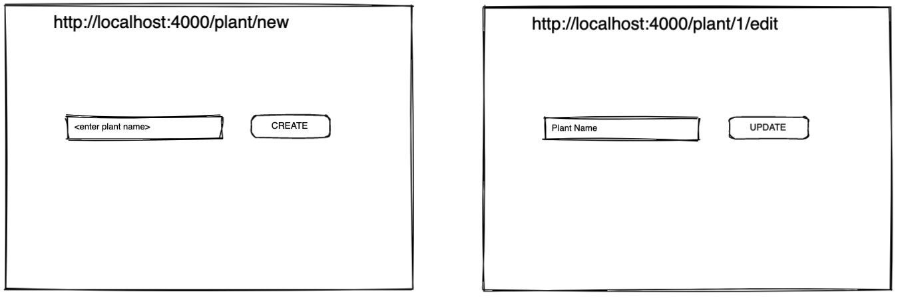

# Lesson - RESTful

## Lesson Plan

|#|Item|Duration|
|-|-----|--------|
|1|Lesson - RESTful|1 hr|
|-|BREAK|10 mins|
|2|Lesson - MVC Model with EJS|50 mins|
|-|BREAK|10 mins|
|3|Lab + Q&A|

## Starter Code

Replace `server.js` with the code below.

```js
require('dotenv').config()
const express = require("express");
const app = express();

const plants = [
  "Monstera Deliciosa",
  "Corpse Flower",
  "Elephant-Foot Yam",
  "Witches' Butter",
];

app.listen(process.env.PORT, () => {
  console.log(`I am listening to port ${process.env.PORT}`);
});
```

## Introduction to RESTful

> RESTful API is a convention on how online resources can be read and manipulated via HTTP Endpoints.

The 7 RESTful routes that allow us basic operations for reading and manipulating a collection of data:

|#| **URL** | **HTTP Verb** |  **Action**|**Content Type**|
|-|------------|-------------|------------|---------------|
|1| /plants          | GET       | index  |application/json|
|2| /plants/new      | GET       | new    |text/html|
|3| /plants          | POST      | create |application/json|  
|4| /plants/:id      | GET       | show   |application/json|
|5| /plants/:id/edit | GET       | edit   |text/html|
|6| /plants/:id      | PATCH/PUT | update |application/json|
|7| /plants/:id      | DELETE    | destroy|application/json|

> PUT is used to update entire object.
> PATCH is used to update partial object.

## Hands On - Implementing RESTful Endpoints

Install:

```sh
npm i http-status body-parser
```

|#| **URL** | **HTTP Verb** |  **Action**|**Content Type**|
|-|------------|-------------|------------|---------------|
|1| /plants/         | GET       | index  |application/json|
|2| /plants          | POST      | create |application/json|  
|3| /plants/:id      | GET       | show   |application/json|
|4| /plants/:id      | PUT       | update |application/json|
|5| /plants/:id      | DELETE    | destroy|application/json|

## Introducing Concept - MVC


Separating the:
- model (data)
- view (what user interacts with)
- controller (logics)

> There is no database at the moment, we will see the full example after database lesson.

## Hands On - Coding with EJS

Install:
```sh
npm i ejs
```

|#| **URL** | **HTTP Verb** |  **Action**|**Content Type**|
|-|------------|-------------|------------|---------------|
|1| /plants/new      | GET       | new    |text/html|
|2| /plants/:id/edit | GET       | edit   |text/html|



## Lab

> Check in for 26 Nov DevFest interests

[Link](https://git.generalassemb.ly/sei-sg/SEIF-11/blob/master/unit_3/w14d03/labs/exobiology_delete.md)